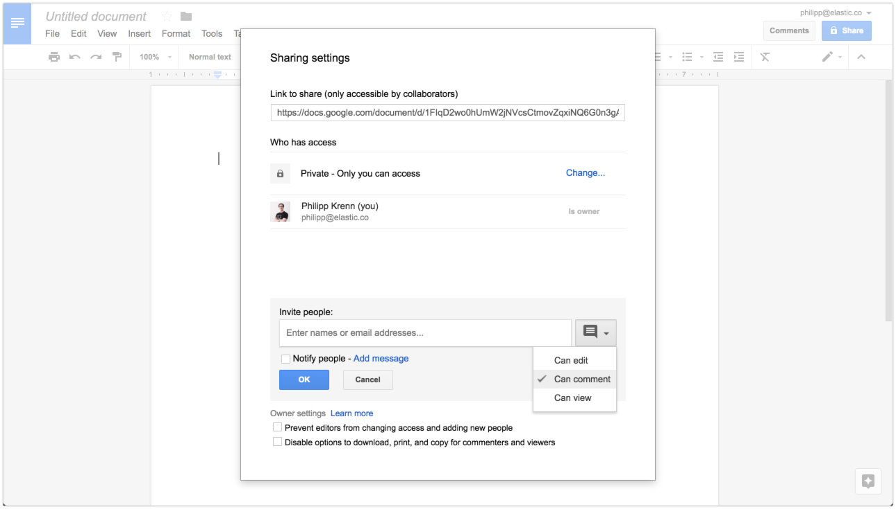

# Elastic's Google Summer of Code

[Elastic](https://www.elastic.co) is excited to participate in the Google Summer of Code 2020 program and we hope that you are too!

This readme will get you started with project ideas, mentors, where to ask questions, and how to apply. Please note that this year we are only participating with the [Elastic UI repository](https://github.com/elastic/eui).

## What is the Elastic UI Framework and why are we excited about this project?

The Elastic UI framework (EUI) is at the :heart: of all interfaces at Elastic. It started as the design system for [Kibana](https://github.com/elastic/kibana) but has grown to be used by and shaped by teams across Elastic. Recently, EUI has been adopted by projects large and small outside of Elastic, and has welcomed contributions from designers and developers all over the world.

The teams that have adopted EUI move fast and are continuously releasing great features. What this means is that EUI is constantly improving and growing to support those teams. We often release updates weekly, and new features can have an immediate impact, leading to quick feedback cycles and new ideas. We take feature requests seriously and truly appreciate those that take time to help improve EUI.

We feel that the best way to keep improving EUI and supporting the growing number of teams adopting it is to

1. stabilize our support for widely-used projects and platforms outside Elastic, and
2. continue to provide thorough, thoughtful, usable documentation.

In our attempt to solve a real need in the open source community, we want to be as helpful as possible in getting folks started the right way.

## Application Instructions

Please read and apply via [https://summerofcode.withgoogle.com/get-started/](https://summerofcode.withgoogle.com/get-started/).

In your application please tell us about:

1. **You**: Your name and how to contact you.
1. **Project**: Which of our project ideas you want to be working on or if it is your own, describe it in detail.
1. **Deliverables**: What is the outcome of your project. The more technical details are the better.
1. **Timeline**: Provide a detailed work timeline that breaks the project into one-week milestones and align them to the GSoC timeline.
1. **Availability**: Describe your time commitment and be very explicit about any other engagements — both related to work and holidays or trips. No surprises, please.
1. **Pull request**: Link to a pull request you have submitted to the project you want to work on.
  It is not required to have the pull request merged since reviewing can take time and we do not rush that process. We want to see that you can contribute in a meaningful way to the project you want to be working on. Start small and only add more complex tasks later on. And while documentation fixes or enhancement are welcome, showing your programming skills will earn you bonus points.
  Here is a starting point for issues you could dive into: [EUI `good first issue`](https://github.com/elastic/eui/issues?q=is%3Aopen+is%3Aissue+label%3A%22good+first+issue%22)

If you want us to review your application before the final submission:

* Create a Google Doc and add it as a draft in the [GSoC application](https://summerofcode.withgoogle.com).
* Once you are ready for a review, share the document with the mentors listed for your project with the permission `Can comment` — see the screenshot below.

Elastic is always seeking to diversify its contributors and especially welcomes applications from women from all backgrounds and people of color.

## Team

* [Aravind Putrevu](https://github.com/aravindputrevu) admin
* [Chandler Prall](https://github.com/chandlerprall) mentor
* [Dave Snider](https://github.com/snide) mentor
* [Greg Thompson](https://github.com/thompsongl) mentor
* [Philipp Krenn](https://github.com/xeraa) admin
* [Stephanie Nissen](https://github.com/Stephanie-Nissen) admin

## Ideas

These are suggestions that we think would make good Google Summer of Code projects.

Please start a question on our [GSoC Discuss group](https://discuss.elastic.co/c/elastic-community-ecosystem/elastic-gsoc) if you wish to propose your idea — there are also some [pointers for other ideas](#other). We value your initiative, so don't be shy.

### Automatic Documentation System for TypeScript Components

#### Brief Explanation

A better automatic system for documenting EUI TypeScript components. Specifically, we're looking for a better method to extract the acceptable values for each prop on the API. This would be done through automatic transversal of the EUI components itself, combined with the type values from TS and our own inline comments.

#### Expected Results

More accurate, robust prop documentation within the existing "Props" tab for each example section in component documentation. As the EUI team is nearing completion of complete TypeScript conversion, it is possible that the current type and prop traversal system can be entirely replaced.

#### Knowledge Prerequisites

* TypeScript
* React - medium
* Elasticsearch - none and we will happily teach the little you would need to learn

#### Skill Level

Medium

#### Mentor

Chandler Prall, Greg Thompson

### Playground / Toggle System for Live Documentation

#### Brief Explanation

A better playground / toggle system for [EUI live documentation](https://elastic.github.io/eui/). Right now we have flat, read-only code displayed next to static examples. It would be nice if people could change the code examples in-browser on our docs site and see the changes live in the examples.

#### Expected Results

An edit mechanism that would allow users to change, add, or otherwise modify props and content in rendered examples.

#### Knowledge Prerequisites

* React - medium
* Elasticsearch - none and we will happily teach the little you would need to learn

#### Skill Level

Medium

#### Mentor

Chandler Prall, Greg Thompson

### Multi-Project Testing Suite

#### Brief Explanation

Automated testing for projects and deployments that we expect EUI to support. Currently, we rely on manual build steps or testing suites (functional and/or unit tests) provided by consuming applications to check environment compatibility and catch instances of breaking API changes. Conversion to and adoption of TypeScript has helped at a low level, but we need broader, less manual means of understanding support coverage.

#### Expected Results

As script or pattern of scripts that EUI engineers can run to:

1. Install EUI in various project target instances; [elastic/eui#2760](https://github.com/elastic/eui/issues/2760) tracks the discussion about which projects to support.
2. Run the consuming project's linting and / or testing suite(s).
3. Run a production build of the consuming project.
4. Detect and report failures and incompatibilities.

#### Knowledge Prerequisites

* Test automation
* React - medium
* Elasticsearch - none and we will happily teach the little you would need to learn

#### Skill Level

Medium

#### Mentor

Chandler Prall, Greg Thompson

### Other Ideas

You may get some inspiration from our [existing issues](https://github.com/elastic/eui/issues).

Please discuss any project ideas on the [GSoC Discuss group](https://discuss.elastic.co/c/elastic-community-ecosystem/elastic-gsoc) with us before submitting to maximize your chances of being accepted.

## I Need Help

For all questions like the application process, your pull request,... head over to our [GSoC Discuss group](https://discuss.elastic.co/c/elastic-community-ecosystem/elastic-gsoc).
